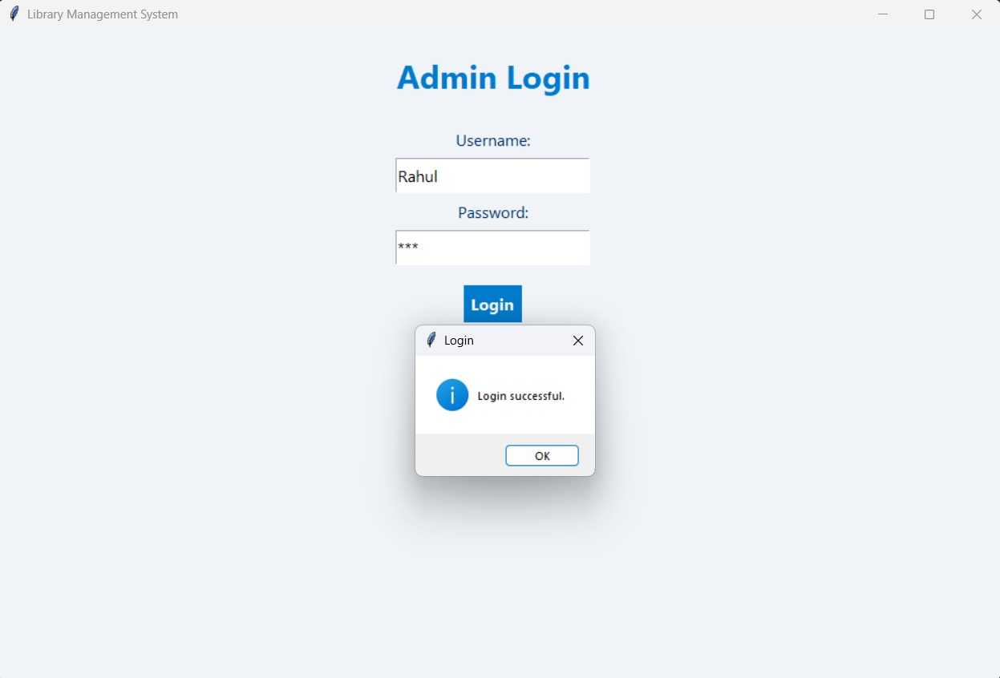
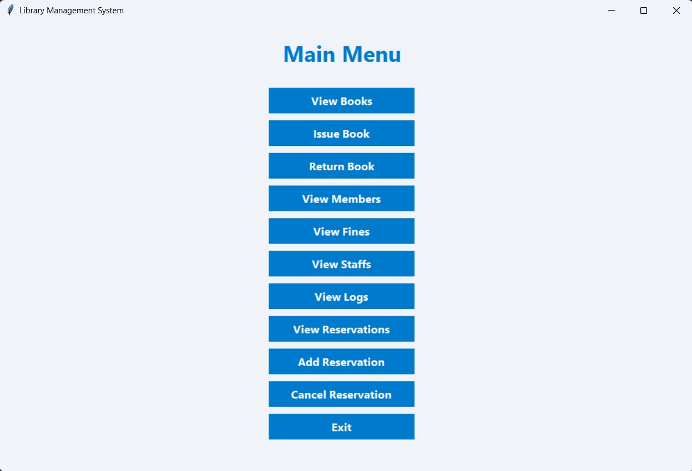
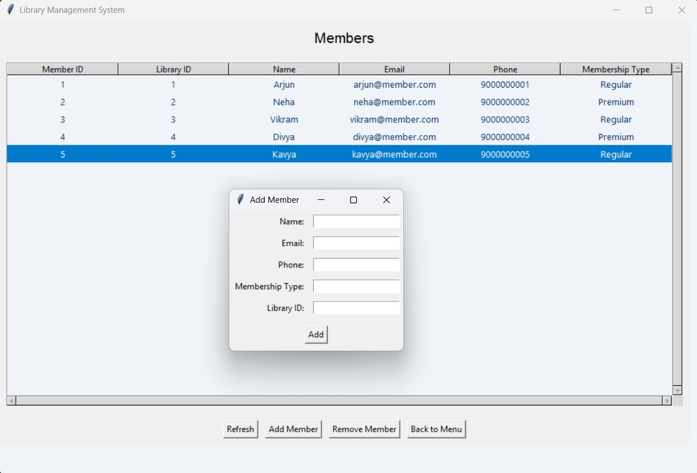

# 📚 Library Management System

A desktop-based Library Management System built with Python and MySQL that allows staff to manage books, members, transactions, and fines efficiently. The system supports issuing/returning books, tracking reservations, managing staff, and logging all actions for accountability.

---

## 🚀 Features

- 🧾 Add, update, and delete books, members, and staff
- 🔄 Issue and return books with due date tracking
- 🔍 Search transactions and reservations
- 💰 Fine management for late returns
- 📋 Logs for user activity and transaction history
- 💾 Backup and restore support

---

## 🛠 Tech Stack

- 🐍 Python 3.x
- 🗃 MySQL
- 🎨 Tkinter (for GUI)
- 📦 mysql-connector-python (DB driver)

---

## 🗂 Folder Structure

```bash
Library-Management-System/
│
├── __pycache__/               # Python bytecode cache
├── backup/
│   └── gui_main.py            # Optional backup GUI module
├── books.py                   # Book management
├── create_db.py               # DB schema setup
├── fines.py                   # Fine calculation logic
├── issue_return.py            # Book issue/return handling
├── logs.py                    # Logging user actions
├── main.py                    # Main GUI launcher
├── members.py                 # Member management
├── reservations.py            # Book reservations
├── staffs.py                  # Staff management
└── README.md
```
---

## 📷 Screenshots

| Login                         | Menu                    | Members                           |
|-----------------------------------|----------------------------------|---------------------------------|
|  |  |  |


## 🧪 How to Run Locally

Clone the repository:
    ```bash
    git clone https://github.com/Rahul-KrishnaA/Library-Management-System.git
    cd Library-Management-System
    ```
Set up MySQL and create the database:
    Run:
        ```bash
        python create_db.py
        ```
    Launch the app:
        ```bash
        python main.py
        ```
⚙ Requirements

    Install dependencies:
        ```bash
        pip install mysql-connector-python
        ```
Make sure MySQL server is running and credentials are correctly set in create_db.py or wherever required.

🙌 Contributing
Pull requests are welcome! For major changes, please open an issue first to discuss what you would like to change.
